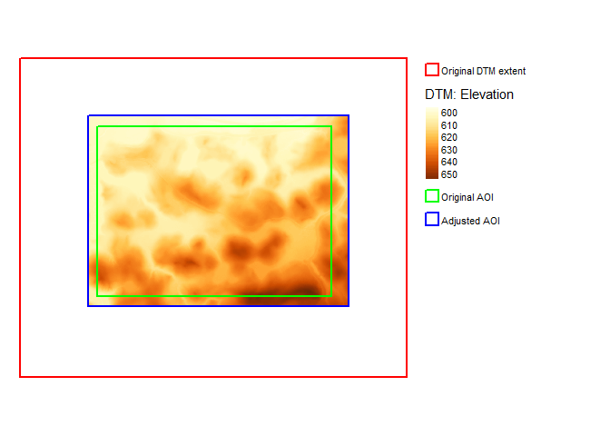

<center>
<h1>
`PEMgeneratr`
</h1>
</center>

<div style = "

pre {
    height: auto;
    max-height: 200px;
    overflow: auto;
    background-color: #eeeeee;
    word-break: normal !important;
    word-wrap: normal !important;
    white-space: pre !important;
};​
    
pre {
    height: auto;
    max-height: 200px;
    overflow: auto;
    background-color: #eeeeee;
    word-break: normal !important;
    word-wrap: normal !important;
    white-space: pre !important;
};​
">
</style>


``` r
library(tidyverse)
library(knitr)
library(kableExtra) ##devtools::install_github("haozhu233/kableExtra")

library(sf)
library(raster)
library(rgdal)
library(tmap)

library(PEMgeneratr) ## OUR NEW PACKAGE
```

<!-- # Purpose -->
<!-- Provide a package of tools to support British Columbia's Predictive Ecosystem Mapping project -->
<!-- The General workflow includes: -->
<!--   1. Generation of multi-scale covariates.  Many of these created from high-resolution digital terrain models. -->
<!--   2. Creation of the <tt>Stage 1</tt> sampling plan based on conditioned Latin Hypercube sampling (cLHS) -->
<!--   3. Processing of <tt>Stage 1</tt> field data -->
<!--   4. Generation of <tt>PEM_v1</tt> that including: -->
<!--       - predictive map of all ecological units (i.e. site series) -->
<!--       - probability maps for each eco-unit -->
<!--       - Entropy raster showing where highest uncertainty exists -->
<!--   5. Generation of <tt>Stage 2</tt> sampling plan -->
<!--       - masks out areas of high certainty -- removing these from sampling -->
<!--       - locates points for sampling using cLHS -->
<!--       - optimizes field data transect locations -- maximizing the variability from the <tt>PEM_v1</tt> -->
<!--   6. Processing of <tt>Stage 2</tt> field data -->
<!--   7. Generation of a final Predictive Ecosystem Map -->

The scenario example
====================

For demonstration purposes a harvest block from the [Aleza Lake Research
Forest](http://alrf.unbc.ca) has been selected to predict the ecosystem
classes within the block area using British Columbia’s BC’s [Biogeoclimatic Ecosystem Classification (BEC) system](https://www.for.gov.bc.ca/hre/becweb/index.html).

Generate Co-variates
====================

To start this package will examine DTM derived layers. *Note:
incorporation of satellite data is scheduled for development.*

Additionally, for this example a small sub-set of data is use.
Additional scripting will be needed to tile data for parallel process
and landscape level analysis.

Area of interest: `aoi_snap()`
------------------------------

A polygon is loaded and the extent of that polygon is used to determine
the area of interest. However, in order to get the various resolutions
of data to stack well, essential for later processing, it is *critically
important* that the all corners of the area of interest are divisible by
the resolutions to be generated (i.e. 2.5, 5, 10, and 25m<sup>2</sup>).
To accomplish this the raw aoi interest polygon’s extent is pushed out
to the nearest 100m.

*Note: The area of interest needs to be within the bounds of the extent
of the input raster. Currently, `aoi_snap()` expands the aoi perhaps a
version that shrinks the aoi should be created (this could be a
parameter specification).*

``` r
aoi_raw <- st_read("../data/block.gpkg", quiet = TRUE)
e <- as(extent(aoi_raw), "SpatialPolygons") ## for use in map below.
aoi <- aoi_snap(aoi_raw)
```

    ## [1] "initial extent is:"
    ##      xmin      ymin      xmax      ymax 
    ##  558347.9 5994757.5  559700.9 5995734.5 
    ## [1] "Expanded extent is:"
    ##    xmin    ymin    xmax    ymax 
    ##  558300 5994700  559800 5995800

Initial Digital Terrain Models
------------------------------

Here the DTM is loaded and cropped to the area of interest. The multiple
resolutions of the DTM are generated, and then the co-variates are
generated.

*Note for the project we have decided to start with 2.5m<sup>2</sup> as
the finest pixel resolution.* In the example below the initial DTM is
1m<sup>2</sup> resolution which is used to generate the coarser
resolutions.

### Load DTM

``` r
# dtm <- data(dtm) ## Sample data provided -- ACTION DOCUMENT THIS.... not working
dtm <- raster("../data/dtm.tif")
dtm_e <- as(extent(dtm), "SpatialPolygons") ## for use in map below

dim(dtm); extent(dtm)
```

    ## [1] 1835 2226    1

    ## class      : Extent 
    ## xmin       : 557905 
    ## xmax       : 560131 
    ## ymin       : 5994293 
    ## ymax       : 5996128

### Crop DTM `aoi_snap()`

The DTM is cropped to the aoi expanded out to the nearest 100m. This
will allow for stacking of multi resolution layers later.

``` r
dtm <- crop(dtm, aoi)
dim(dtm) ; extent(dtm)
```

    ## [1] 1100 1500    1

    ## class      : Extent 
    ## xmin       : 558300 
    ## xmax       : 559800 
    ## ymin       : 5994700 
    ## ymax       : 5995800

Below the original extent of the DTM is in red. The original area of
interest is in green, based on the shapefile received is in green, and
the adjusted area of interest is the color raster dtm. This new extent
is based on an adjusted area of interest – expanded out to the nearest
100m.



Generate Multi-resolutions: `multi_res()`
-----------------------------------------

Ecological processes take place across different scales. In an effort to
incorporate this into the modeling process multiple scales of covariates
are generated. This project will work with resolutions of 2.5, 5, 10,
and 25m<sup>2</sup>. This function takes the input raster and resamples
it to the target resolutions while ensuring that all rasters have the
same exact extent – allowing for stacking of the rasters later.

``` r
outputFolder <- "e:/tmp/dtms"

## Generate alternate coarser grain resolutions of the input
multi_res(dtm, output = outputFolder, resolution = c(2.5, 5, 10, 25))

# confirms same extent
  l <- list.files(outputFolder, pattern = "*.tif", recursive = TRUE, full.names = TRUE)

  for(i in l){
  c <- raster(i) ;   print(i) ;  print("Resolution") ;  print(res(c)) ; print(as.vector(extent(c)))
  }
```

    ## [1] "e:/tmp/dtms/10/dtm_10.tif"
    ## [1] "Resolution"
    ## [1] 10 10
    ## [1]  558300  559800 5994700 5995800
    ## [1] "e:/tmp/dtms/2.5/dtm_2.5.tif"
    ## [1] "Resolution"
    ## [1] 2.5 2.5
    ## [1]  558300  559800 5994700 5995800
    ## [1] "e:/tmp/dtms/25/dtm_25.tif"
    ## [1] "Resolution"
    ## [1] 25 25
    ## [1]  558300  559800 5994700 5995800
    ## [1] "e:/tmp/dtms/5/dtm_5.tif"
    ## [1] "Resolution"
    ## [1] 5 5
    ## [1]  558300  559800 5994700 5995800

Generate terrain co-variates: `cv_dtm()`
----------------------------------------

This function makes external calls for SAGA GIS to create the
co-variates, converts these to geoTif, and removes the tmp files

Note that these functions *did not* work with the bundled OSgeo4W (SAGA
2.1). Make sure you have an installation of [SAGA
7.x](https://sourceforge.net/projects/saga-gis/).

For demonstration the 25m raster is co-variates are generated.

``` r
output_CoVars <- "e:/tmp" ## where to place the covariates

l <- list.files(outputFolder, recursive = TRUE, full.names = TRUE) ## list of DTMs to process


if(!dir.exists(output_CoVars)){## skip this if they are already generated -- for easier report generation.
  for(i in l){  ## Loop through Resolutions and produce covariates
    # i<-l[1] ##testing

    print(i)
    dtm <- raster(i)
    cv_dtm(dtm, SAGApath = "C:/SAGA/", output = output_CoVars)
  }
}
```

### A Summary table of files generated

<div style="border: 1px solid #ddd; padding: 0px; overflow-y: scroll; height:300px; overflow-x: scroll; width:100%; ">
<table class="table" style="margin-left: auto; margin-right: auto;">
<thead>
<tr>
<th style="text-align:left;position: sticky; top:0; background-color: #FFFFFF;position: sticky; top:0; background-color: #FFFFFF;">
File
</th>
<th style="text-align:right;position: sticky; top:0; background-color: #FFFFFF;position: sticky; top:0; background-color: #FFFFFF;">
xmin
</th>
<th style="text-align:right;position: sticky; top:0; background-color: #FFFFFF;position: sticky; top:0; background-color: #FFFFFF;">
xmax
</th>
<th style="text-align:right;position: sticky; top:0; background-color: #FFFFFF;position: sticky; top:0; background-color: #FFFFFF;">
ymin
</th>
<th style="text-align:right;position: sticky; top:0; background-color: #FFFFFF;position: sticky; top:0; background-color: #FFFFFF;">
ymax
</th>
<th style="text-align:right;position: sticky; top:0; background-color: #FFFFFF;position: sticky; top:0; background-color: #FFFFFF;">
res
</th>
</tr>
</thead>
<tbody>
<tr>
<td style="text-align:left;">
Aspect\_10.tif
</td>
<td style="text-align:right;">
558300
</td>
<td style="text-align:right;">
559800
</td>
<td style="text-align:right;">
5994700
</td>
<td style="text-align:right;">
5995800
</td>
<td style="text-align:right;">
10.0
</td>
</tr>
<tr>
<td style="text-align:left;">
Aspect\_10.tif
</td>
<td style="text-align:right;">
558300
</td>
<td style="text-align:right;">
559800
</td>
<td style="text-align:right;">
5994700
</td>
<td style="text-align:right;">
5995800
</td>
<td style="text-align:right;">
2.5
</td>
</tr>
<tr>
<td style="text-align:left;">
Aspect\_2.5.tif
</td>
<td style="text-align:right;">
558300
</td>
<td style="text-align:right;">
559800
</td>
<td style="text-align:right;">
5994700
</td>
<td style="text-align:right;">
5995800
</td>
<td style="text-align:right;">
2.5
</td>
</tr>
<tr>
<td style="text-align:left;">
Aspect\_25.tif
</td>
<td style="text-align:right;">
558300
</td>
<td style="text-align:right;">
559800
</td>
<td style="text-align:right;">
5994700
</td>
<td style="text-align:right;">
5995800
</td>
<td style="text-align:right;">
2.5
</td>
</tr>
<tr>
<td style="text-align:left;">
Aspect\_25.tif
</td>
<td style="text-align:right;">
558300
</td>
<td style="text-align:right;">
559800
</td>
<td style="text-align:right;">
5994700
</td>
<td style="text-align:right;">
5995800
</td>
<td style="text-align:right;">
25.0
</td>
</tr>
<tr>
<td style="text-align:left;">
Aspect\_5.tif
</td>
<td style="text-align:right;">
558300
</td>
<td style="text-align:right;">
559800
</td>
<td style="text-align:right;">
5994700
</td>
<td style="text-align:right;">
5995800
</td>
<td style="text-align:right;">
2.5
</td>
</tr>
<tr>
<td style="text-align:left;">
Aspect\_5.tif
</td>
<td style="text-align:right;">
558300
</td>
<td style="text-align:right;">
559800
</td>
<td style="text-align:right;">
5994700
</td>
<td style="text-align:right;">
5995800
</td>
<td style="text-align:right;">
5.0
</td>
</tr>
<tr>
<td style="text-align:left;">
Channel\_network\_grid\_10.tif
</td>
<td style="text-align:right;">
558300
</td>
<td style="text-align:right;">
559800
</td>
<td style="text-align:right;">
5994700
</td>
<td style="text-align:right;">
5995800
</td>
<td style="text-align:right;">
10.0
</td>
</tr>
<tr>
<td style="text-align:left;">
Channel\_network\_grid\_10.tif
</td>
<td style="text-align:right;">
558300
</td>
<td style="text-align:right;">
559800
</td>
<td style="text-align:right;">
5994700
</td>
<td style="text-align:right;">
5995800
</td>
<td style="text-align:right;">
2.5
</td>
</tr>
<tr>
<td style="text-align:left;">
Channel\_network\_grid\_2.5.tif
</td>
<td style="text-align:right;">
558300
</td>
<td style="text-align:right;">
559800
</td>
<td style="text-align:right;">
5994700
</td>
<td style="text-align:right;">
5995800
</td>
<td style="text-align:right;">
2.5
</td>
</tr>
<tr>
<td style="text-align:left;">
Channel\_network\_grid\_25.tif
</td>
<td style="text-align:right;">
558300
</td>
<td style="text-align:right;">
559800
</td>
<td style="text-align:right;">
5994700
</td>
<td style="text-align:right;">
5995800
</td>
<td style="text-align:right;">
2.5
</td>
</tr>
<tr>
<td style="text-align:left;">
Channel\_network\_grid\_25.tif
</td>
<td style="text-align:right;">
558300
</td>
<td style="text-align:right;">
559800
</td>
<td style="text-align:right;">
5994700
</td>
<td style="text-align:right;">
5995800
</td>
<td style="text-align:right;">
25.0
</td>
</tr>
<tr>
<td style="text-align:left;">
Channel\_network\_grid\_5.tif
</td>
<td style="text-align:right;">
558300
</td>
<td style="text-align:right;">
559800
</td>
<td style="text-align:right;">
5994700
</td>
<td style="text-align:right;">
5995800
</td>
<td style="text-align:right;">
2.5
</td>
</tr>
<tr>
<td style="text-align:left;">
Channel\_network\_grid\_5.tif
</td>
<td style="text-align:right;">
558300
</td>
<td style="text-align:right;">
559800
</td>
<td style="text-align:right;">
5994700
</td>
<td style="text-align:right;">
5995800
</td>
<td style="text-align:right;">
5.0
</td>
</tr>
<tr>
<td style="text-align:left;">
Convergence\_10.tif
</td>
<td style="text-align:right;">
558300
</td>
<td style="text-align:right;">
559800
</td>
<td style="text-align:right;">
5994700
</td>
<td style="text-align:right;">
5995800
</td>
<td style="text-align:right;">
10.0
</td>
</tr>
<tr>
<td style="text-align:left;">
Convergence\_10.tif
</td>
<td style="text-align:right;">
558300
</td>
<td style="text-align:right;">
559800
</td>
<td style="text-align:right;">
5994700
</td>
<td style="text-align:right;">
5995800
</td>
<td style="text-align:right;">
2.5
</td>
</tr>
<tr>
<td style="text-align:left;">
Convergence\_2.5.tif
</td>
<td style="text-align:right;">
558300
</td>
<td style="text-align:right;">
559800
</td>
<td style="text-align:right;">
5994700
</td>
<td style="text-align:right;">
5995800
</td>
<td style="text-align:right;">
2.5
</td>
</tr>
<tr>
<td style="text-align:left;">
Convergence\_25.tif
</td>
<td style="text-align:right;">
558300
</td>
<td style="text-align:right;">
559800
</td>
<td style="text-align:right;">
5994700
</td>
<td style="text-align:right;">
5995800
</td>
<td style="text-align:right;">
2.5
</td>
</tr>
<tr>
<td style="text-align:left;">
Convergence\_25.tif
</td>
<td style="text-align:right;">
558300
</td>
<td style="text-align:right;">
559800
</td>
<td style="text-align:right;">
5994700
</td>
<td style="text-align:right;">
5995800
</td>
<td style="text-align:right;">
25.0
</td>
</tr>
<tr>
<td style="text-align:left;">
Convergence\_5.tif
</td>
<td style="text-align:right;">
558300
</td>
<td style="text-align:right;">
559800
</td>
<td style="text-align:right;">
5994700
</td>
<td style="text-align:right;">
5995800
</td>
<td style="text-align:right;">
2.5
</td>
</tr>
<tr>
<td style="text-align:left;">
Convergence\_5.tif
</td>
<td style="text-align:right;">
558300
</td>
<td style="text-align:right;">
559800
</td>
<td style="text-align:right;">
5994700
</td>
<td style="text-align:right;">
5995800
</td>
<td style="text-align:right;">
5.0
</td>
</tr>
<tr>
<td style="text-align:left;">
cvs.tif
</td>
<td style="text-align:right;">
552600
</td>
<td style="text-align:right;">
567850
</td>
<td style="text-align:right;">
5983800
</td>
<td style="text-align:right;">
5996850
</td>
<td style="text-align:right;">
2.5
</td>
</tr>
<tr>
<td style="text-align:left;">
dAH\_10.tif
</td>
<td style="text-align:right;">
558300
</td>
<td style="text-align:right;">
559800
</td>
<td style="text-align:right;">
5994700
</td>
<td style="text-align:right;">
5995800
</td>
<td style="text-align:right;">
10.0
</td>
</tr>
<tr>
<td style="text-align:left;">
dAH\_10.tif
</td>
<td style="text-align:right;">
558300
</td>
<td style="text-align:right;">
559800
</td>
<td style="text-align:right;">
5994700
</td>
<td style="text-align:right;">
5995800
</td>
<td style="text-align:right;">
2.5
</td>
</tr>
<tr>
<td style="text-align:left;">
dAH\_2.5.tif
</td>
<td style="text-align:right;">
558300
</td>
<td style="text-align:right;">
559800
</td>
<td style="text-align:right;">
5994700
</td>
<td style="text-align:right;">
5995800
</td>
<td style="text-align:right;">
2.5
</td>
</tr>
<tr>
<td style="text-align:left;">
dAH\_25.tif
</td>
<td style="text-align:right;">
558300
</td>
<td style="text-align:right;">
559800
</td>
<td style="text-align:right;">
5994700
</td>
<td style="text-align:right;">
5995800
</td>
<td style="text-align:right;">
2.5
</td>
</tr>
<tr>
<td style="text-align:left;">
dAH\_25.tif
</td>
<td style="text-align:right;">
558300
</td>
<td style="text-align:right;">
559800
</td>
<td style="text-align:right;">
5994700
</td>
<td style="text-align:right;">
5995800
</td>
<td style="text-align:right;">
25.0
</td>
</tr>
<tr>
<td style="text-align:left;">
dAH\_5.tif
</td>
<td style="text-align:right;">
558300
</td>
<td style="text-align:right;">
559800
</td>
<td style="text-align:right;">
5994700
</td>
<td style="text-align:right;">
5995800
</td>
<td style="text-align:right;">
2.5
</td>
</tr>
<tr>
<td style="text-align:left;">
dAH\_5.tif
</td>
<td style="text-align:right;">
558300
</td>
<td style="text-align:right;">
559800
</td>
<td style="text-align:right;">
5994700
</td>
<td style="text-align:right;">
5995800
</td>
<td style="text-align:right;">
5.0
</td>
</tr>
<tr>
<td style="text-align:left;">
difinsol\_10.tif
</td>
<td style="text-align:right;">
558300
</td>
<td style="text-align:right;">
559800
</td>
<td style="text-align:right;">
5994700
</td>
<td style="text-align:right;">
5995800
</td>
<td style="text-align:right;">
10.0
</td>
</tr>
<tr>
<td style="text-align:left;">
difinsol\_10.tif
</td>
<td style="text-align:right;">
558300
</td>
<td style="text-align:right;">
559800
</td>
<td style="text-align:right;">
5994700
</td>
<td style="text-align:right;">
5995800
</td>
<td style="text-align:right;">
2.5
</td>
</tr>
<tr>
<td style="text-align:left;">
difinsol\_2.5.tif
</td>
<td style="text-align:right;">
558300
</td>
<td style="text-align:right;">
559800
</td>
<td style="text-align:right;">
5994700
</td>
<td style="text-align:right;">
5995800
</td>
<td style="text-align:right;">
2.5
</td>
</tr>
<tr>
<td style="text-align:left;">
difinsol\_25.tif
</td>
<td style="text-align:right;">
558300
</td>
<td style="text-align:right;">
559800
</td>
<td style="text-align:right;">
5994700
</td>
<td style="text-align:right;">
5995800
</td>
<td style="text-align:right;">
2.5
</td>
</tr>
<tr>
<td style="text-align:left;">
difinsol\_25.tif
</td>
<td style="text-align:right;">
558300
</td>
<td style="text-align:right;">
559800
</td>
<td style="text-align:right;">
5994700
</td>
<td style="text-align:right;">
5995800
</td>
<td style="text-align:right;">
25.0
</td>
</tr>
<tr>
<td style="text-align:left;">
difinsol\_5.tif
</td>
<td style="text-align:right;">
558300
</td>
<td style="text-align:right;">
559800
</td>
<td style="text-align:right;">
5994700
</td>
<td style="text-align:right;">
5995800
</td>
<td style="text-align:right;">
2.5
</td>
</tr>
<tr>
<td style="text-align:left;">
difinsol\_5.tif
</td>
<td style="text-align:right;">
558300
</td>
<td style="text-align:right;">
559800
</td>
<td style="text-align:right;">
5994700
</td>
<td style="text-align:right;">
5995800
</td>
<td style="text-align:right;">
5.0
</td>
</tr>
<tr>
<td style="text-align:left;">
dirinsol\_10.tif
</td>
<td style="text-align:right;">
558300
</td>
<td style="text-align:right;">
559800
</td>
<td style="text-align:right;">
5994700
</td>
<td style="text-align:right;">
5995800
</td>
<td style="text-align:right;">
10.0
</td>
</tr>
<tr>
<td style="text-align:left;">
dirinsol\_10.tif
</td>
<td style="text-align:right;">
558300
</td>
<td style="text-align:right;">
559800
</td>
<td style="text-align:right;">
5994700
</td>
<td style="text-align:right;">
5995800
</td>
<td style="text-align:right;">
2.5
</td>
</tr>
<tr>
<td style="text-align:left;">
dirinsol\_2.5.tif
</td>
<td style="text-align:right;">
558300
</td>
<td style="text-align:right;">
559800
</td>
<td style="text-align:right;">
5994700
</td>
<td style="text-align:right;">
5995800
</td>
<td style="text-align:right;">
2.5
</td>
</tr>
<tr>
<td style="text-align:left;">
dirinsol\_25.tif
</td>
<td style="text-align:right;">
558300
</td>
<td style="text-align:right;">
559800
</td>
<td style="text-align:right;">
5994700
</td>
<td style="text-align:right;">
5995800
</td>
<td style="text-align:right;">
2.5
</td>
</tr>
<tr>
<td style="text-align:left;">
dirinsol\_25.tif
</td>
<td style="text-align:right;">
558300
</td>
<td style="text-align:right;">
559800
</td>
<td style="text-align:right;">
5994700
</td>
<td style="text-align:right;">
5995800
</td>
<td style="text-align:right;">
25.0
</td>
</tr>
<tr>
<td style="text-align:left;">
dirinsol\_5.tif
</td>
<td style="text-align:right;">
558300
</td>
<td style="text-align:right;">
559800
</td>
<td style="text-align:right;">
5994700
</td>
<td style="text-align:right;">
5995800
</td>
<td style="text-align:right;">
2.5
</td>
</tr>
<tr>
<td style="text-align:left;">
dirinsol\_5.tif
</td>
<td style="text-align:right;">
558300
</td>
<td style="text-align:right;">
559800
</td>
<td style="text-align:right;">
5994700
</td>
<td style="text-align:right;">
5995800
</td>
<td style="text-align:right;">
5.0
</td>
</tr>
<tr>
<td style="text-align:left;">
dtm\_10.tif
</td>
<td style="text-align:right;">
558300
</td>
<td style="text-align:right;">
559800
</td>
<td style="text-align:right;">
5994700
</td>
<td style="text-align:right;">
5995800
</td>
<td style="text-align:right;">
10.0
</td>
</tr>
<tr>
<td style="text-align:left;">
dtm\_10.tif
</td>
<td style="text-align:right;">
558300
</td>
<td style="text-align:right;">
559800
</td>
<td style="text-align:right;">
5994700
</td>
<td style="text-align:right;">
5995800
</td>
<td style="text-align:right;">
2.5
</td>
</tr>
<tr>
<td style="text-align:left;">
dtm\_10.tif
</td>
<td style="text-align:right;">
558300
</td>
<td style="text-align:right;">
559800
</td>
<td style="text-align:right;">
5994700
</td>
<td style="text-align:right;">
5995800
</td>
<td style="text-align:right;">
10.0
</td>
</tr>
<tr>
<td style="text-align:left;">
dtm\_2.5.tif
</td>
<td style="text-align:right;">
558300
</td>
<td style="text-align:right;">
559800
</td>
<td style="text-align:right;">
5994700
</td>
<td style="text-align:right;">
5995800
</td>
<td style="text-align:right;">
2.5
</td>
</tr>
<tr>
<td style="text-align:left;">
dtm\_2.5.tif
</td>
<td style="text-align:right;">
558300
</td>
<td style="text-align:right;">
559800
</td>
<td style="text-align:right;">
5994700
</td>
<td style="text-align:right;">
5995800
</td>
<td style="text-align:right;">
2.5
</td>
</tr>
<tr>
<td style="text-align:left;">
dtm\_25.tif
</td>
<td style="text-align:right;">
558300
</td>
<td style="text-align:right;">
559800
</td>
<td style="text-align:right;">
5994700
</td>
<td style="text-align:right;">
5995800
</td>
<td style="text-align:right;">
2.5
</td>
</tr>
<tr>
<td style="text-align:left;">
dtm\_25.tif
</td>
<td style="text-align:right;">
558300
</td>
<td style="text-align:right;">
559800
</td>
<td style="text-align:right;">
5994700
</td>
<td style="text-align:right;">
5995800
</td>
<td style="text-align:right;">
25.0
</td>
</tr>
<tr>
<td style="text-align:left;">
dtm\_25.tif
</td>
<td style="text-align:right;">
558300
</td>
<td style="text-align:right;">
559800
</td>
<td style="text-align:right;">
5994700
</td>
<td style="text-align:right;">
5995800
</td>
<td style="text-align:right;">
25.0
</td>
</tr>
<tr>
<td style="text-align:left;">
dtm\_5.tif
</td>
<td style="text-align:right;">
558300
</td>
<td style="text-align:right;">
559800
</td>
<td style="text-align:right;">
5994700
</td>
<td style="text-align:right;">
5995800
</td>
<td style="text-align:right;">
2.5
</td>
</tr>
<tr>
<td style="text-align:left;">
dtm\_5.tif
</td>
<td style="text-align:right;">
558300
</td>
<td style="text-align:right;">
559800
</td>
<td style="text-align:right;">
5994700
</td>
<td style="text-align:right;">
5995800
</td>
<td style="text-align:right;">
5.0
</td>
</tr>
<tr>
<td style="text-align:left;">
dtm\_5.tif
</td>
<td style="text-align:right;">
558300
</td>
<td style="text-align:right;">
559800
</td>
<td style="text-align:right;">
5994700
</td>
<td style="text-align:right;">
5995800
</td>
<td style="text-align:right;">
5.0
</td>
</tr>
<tr>
<td style="text-align:left;">
Filled\_sinks\_10.tif
</td>
<td style="text-align:right;">
558300
</td>
<td style="text-align:right;">
559800
</td>
<td style="text-align:right;">
5994700
</td>
<td style="text-align:right;">
5995800
</td>
<td style="text-align:right;">
10.0
</td>
</tr>
<tr>
<td style="text-align:left;">
Filled\_sinks\_10.tif
</td>
<td style="text-align:right;">
558300
</td>
<td style="text-align:right;">
559800
</td>
<td style="text-align:right;">
5994700
</td>
<td style="text-align:right;">
5995800
</td>
<td style="text-align:right;">
2.5
</td>
</tr>
<tr>
<td style="text-align:left;">
Filled\_sinks\_2.5.tif
</td>
<td style="text-align:right;">
558300
</td>
<td style="text-align:right;">
559800
</td>
<td style="text-align:right;">
5994700
</td>
<td style="text-align:right;">
5995800
</td>
<td style="text-align:right;">
2.5
</td>
</tr>
<tr>
<td style="text-align:left;">
Filled\_sinks\_25.tif
</td>
<td style="text-align:right;">
558300
</td>
<td style="text-align:right;">
559800
</td>
<td style="text-align:right;">
5994700
</td>
<td style="text-align:right;">
5995800
</td>
<td style="text-align:right;">
2.5
</td>
</tr>
<tr>
<td style="text-align:left;">
Filled\_sinks\_25.tif
</td>
<td style="text-align:right;">
558300
</td>
<td style="text-align:right;">
559800
</td>
<td style="text-align:right;">
5994700
</td>
<td style="text-align:right;">
5995800
</td>
<td style="text-align:right;">
25.0
</td>
</tr>
<tr>
<td style="text-align:left;">
Filled\_sinks\_5.tif
</td>
<td style="text-align:right;">
558300
</td>
<td style="text-align:right;">
559800
</td>
<td style="text-align:right;">
5994700
</td>
<td style="text-align:right;">
5995800
</td>
<td style="text-align:right;">
2.5
</td>
</tr>
<tr>
<td style="text-align:left;">
Filled\_sinks\_5.tif
</td>
<td style="text-align:right;">
558300
</td>
<td style="text-align:right;">
559800
</td>
<td style="text-align:right;">
5994700
</td>
<td style="text-align:right;">
5995800
</td>
<td style="text-align:right;">
5.0
</td>
</tr>
<tr>
<td style="text-align:left;">
gCurvature\_10.tif
</td>
<td style="text-align:right;">
558300
</td>
<td style="text-align:right;">
559800
</td>
<td style="text-align:right;">
5994700
</td>
<td style="text-align:right;">
5995800
</td>
<td style="text-align:right;">
10.0
</td>
</tr>
<tr>
<td style="text-align:left;">
gCurvature\_10.tif
</td>
<td style="text-align:right;">
558300
</td>
<td style="text-align:right;">
559800
</td>
<td style="text-align:right;">
5994700
</td>
<td style="text-align:right;">
5995800
</td>
<td style="text-align:right;">
2.5
</td>
</tr>
<tr>
<td style="text-align:left;">
gCurvature\_2.5.tif
</td>
<td style="text-align:right;">
558300
</td>
<td style="text-align:right;">
559800
</td>
<td style="text-align:right;">
5994700
</td>
<td style="text-align:right;">
5995800
</td>
<td style="text-align:right;">
2.5
</td>
</tr>
<tr>
<td style="text-align:left;">
gCurvature\_25.tif
</td>
<td style="text-align:right;">
558300
</td>
<td style="text-align:right;">
559800
</td>
<td style="text-align:right;">
5994700
</td>
<td style="text-align:right;">
5995800
</td>
<td style="text-align:right;">
2.5
</td>
</tr>
<tr>
<td style="text-align:left;">
gCurvature\_25.tif
</td>
<td style="text-align:right;">
558300
</td>
<td style="text-align:right;">
559800
</td>
<td style="text-align:right;">
5994700
</td>
<td style="text-align:right;">
5995800
</td>
<td style="text-align:right;">
25.0
</td>
</tr>
<tr>
<td style="text-align:left;">
gCurvature\_5.tif
</td>
<td style="text-align:right;">
558300
</td>
<td style="text-align:right;">
559800
</td>
<td style="text-align:right;">
5994700
</td>
<td style="text-align:right;">
5995800
</td>
<td style="text-align:right;">
2.5
</td>
</tr>
<tr>
<td style="text-align:left;">
gCurvature\_5.tif
</td>
<td style="text-align:right;">
558300
</td>
<td style="text-align:right;">
559800
</td>
<td style="text-align:right;">
5994700
</td>
<td style="text-align:right;">
5995800
</td>
<td style="text-align:right;">
5.0
</td>
</tr>
<tr>
<td style="text-align:left;">
MRRTF\_10.tif
</td>
<td style="text-align:right;">
558300
</td>
<td style="text-align:right;">
559800
</td>
<td style="text-align:right;">
5994700
</td>
<td style="text-align:right;">
5995800
</td>
<td style="text-align:right;">
10.0
</td>
</tr>
<tr>
<td style="text-align:left;">
MRRTF\_10.tif
</td>
<td style="text-align:right;">
558300
</td>
<td style="text-align:right;">
559800
</td>
<td style="text-align:right;">
5994700
</td>
<td style="text-align:right;">
5995800
</td>
<td style="text-align:right;">
2.5
</td>
</tr>
<tr>
<td style="text-align:left;">
MRRTF\_2.5.tif
</td>
<td style="text-align:right;">
558300
</td>
<td style="text-align:right;">
559800
</td>
<td style="text-align:right;">
5994700
</td>
<td style="text-align:right;">
5995800
</td>
<td style="text-align:right;">
2.5
</td>
</tr>
<tr>
<td style="text-align:left;">
MRRTF\_25.tif
</td>
<td style="text-align:right;">
558300
</td>
<td style="text-align:right;">
559800
</td>
<td style="text-align:right;">
5994700
</td>
<td style="text-align:right;">
5995800
</td>
<td style="text-align:right;">
2.5
</td>
</tr>
<tr>
<td style="text-align:left;">
MRRTF\_25.tif
</td>
<td style="text-align:right;">
558300
</td>
<td style="text-align:right;">
559800
</td>
<td style="text-align:right;">
5994700
</td>
<td style="text-align:right;">
5995800
</td>
<td style="text-align:right;">
25.0
</td>
</tr>
<tr>
<td style="text-align:left;">
MRRTF\_5.tif
</td>
<td style="text-align:right;">
558300
</td>
<td style="text-align:right;">
559800
</td>
<td style="text-align:right;">
5994700
</td>
<td style="text-align:right;">
5995800
</td>
<td style="text-align:right;">
2.5
</td>
</tr>
<tr>
<td style="text-align:left;">
MRRTF\_5.tif
</td>
<td style="text-align:right;">
558300
</td>
<td style="text-align:right;">
559800
</td>
<td style="text-align:right;">
5994700
</td>
<td style="text-align:right;">
5995800
</td>
<td style="text-align:right;">
5.0
</td>
</tr>
<tr>
<td style="text-align:left;">
MRVBF\_10.tif
</td>
<td style="text-align:right;">
558300
</td>
<td style="text-align:right;">
559800
</td>
<td style="text-align:right;">
5994700
</td>
<td style="text-align:right;">
5995800
</td>
<td style="text-align:right;">
10.0
</td>
</tr>
<tr>
<td style="text-align:left;">
MRVBF\_10.tif
</td>
<td style="text-align:right;">
558300
</td>
<td style="text-align:right;">
559800
</td>
<td style="text-align:right;">
5994700
</td>
<td style="text-align:right;">
5995800
</td>
<td style="text-align:right;">
2.5
</td>
</tr>
<tr>
<td style="text-align:left;">
MRVBF\_2.5.tif
</td>
<td style="text-align:right;">
558300
</td>
<td style="text-align:right;">
559800
</td>
<td style="text-align:right;">
5994700
</td>
<td style="text-align:right;">
5995800
</td>
<td style="text-align:right;">
2.5
</td>
</tr>
<tr>
<td style="text-align:left;">
MRVBF\_25.tif
</td>
<td style="text-align:right;">
558300
</td>
<td style="text-align:right;">
559800
</td>
<td style="text-align:right;">
5994700
</td>
<td style="text-align:right;">
5995800
</td>
<td style="text-align:right;">
2.5
</td>
</tr>
<tr>
<td style="text-align:left;">
MRVBF\_25.tif
</td>
<td style="text-align:right;">
558300
</td>
<td style="text-align:right;">
559800
</td>
<td style="text-align:right;">
5994700
</td>
<td style="text-align:right;">
5995800
</td>
<td style="text-align:right;">
25.0
</td>
</tr>
<tr>
<td style="text-align:left;">
MRVBF\_5.tif
</td>
<td style="text-align:right;">
558300
</td>
<td style="text-align:right;">
559800
</td>
<td style="text-align:right;">
5994700
</td>
<td style="text-align:right;">
5995800
</td>
<td style="text-align:right;">
2.5
</td>
</tr>
<tr>
<td style="text-align:left;">
MRVBF\_5.tif
</td>
<td style="text-align:right;">
558300
</td>
<td style="text-align:right;">
559800
</td>
<td style="text-align:right;">
5994700
</td>
<td style="text-align:right;">
5995800
</td>
<td style="text-align:right;">
5.0
</td>
</tr>
<tr>
<td style="text-align:left;">
OpennessNegative\_10.tif
</td>
<td style="text-align:right;">
558300
</td>
<td style="text-align:right;">
559800
</td>
<td style="text-align:right;">
5994700
</td>
<td style="text-align:right;">
5995800
</td>
<td style="text-align:right;">
10.0
</td>
</tr>
<tr>
<td style="text-align:left;">
OpennessNegative\_10.tif
</td>
<td style="text-align:right;">
558300
</td>
<td style="text-align:right;">
559800
</td>
<td style="text-align:right;">
5994700
</td>
<td style="text-align:right;">
5995800
</td>
<td style="text-align:right;">
2.5
</td>
</tr>
<tr>
<td style="text-align:left;">
OpennessNegative\_2.5.tif
</td>
<td style="text-align:right;">
558300
</td>
<td style="text-align:right;">
559800
</td>
<td style="text-align:right;">
5994700
</td>
<td style="text-align:right;">
5995800
</td>
<td style="text-align:right;">
2.5
</td>
</tr>
<tr>
<td style="text-align:left;">
OpennessNegative\_25.tif
</td>
<td style="text-align:right;">
558300
</td>
<td style="text-align:right;">
559800
</td>
<td style="text-align:right;">
5994700
</td>
<td style="text-align:right;">
5995800
</td>
<td style="text-align:right;">
2.5
</td>
</tr>
<tr>
<td style="text-align:left;">
OpennessNegative\_25.tif
</td>
<td style="text-align:right;">
558300
</td>
<td style="text-align:right;">
559800
</td>
<td style="text-align:right;">
5994700
</td>
<td style="text-align:right;">
5995800
</td>
<td style="text-align:right;">
25.0
</td>
</tr>
<tr>
<td style="text-align:left;">
OpennessNegative\_5.tif
</td>
<td style="text-align:right;">
558300
</td>
<td style="text-align:right;">
559800
</td>
<td style="text-align:right;">
5994700
</td>
<td style="text-align:right;">
5995800
</td>
<td style="text-align:right;">
2.5
</td>
</tr>
<tr>
<td style="text-align:left;">
OpennessNegative\_5.tif
</td>
<td style="text-align:right;">
558300
</td>
<td style="text-align:right;">
559800
</td>
<td style="text-align:right;">
5994700
</td>
<td style="text-align:right;">
5995800
</td>
<td style="text-align:right;">
5.0
</td>
</tr>
<tr>
<td style="text-align:left;">
OpennessPositive\_10.tif
</td>
<td style="text-align:right;">
558300
</td>
<td style="text-align:right;">
559800
</td>
<td style="text-align:right;">
5994700
</td>
<td style="text-align:right;">
5995800
</td>
<td style="text-align:right;">
10.0
</td>
</tr>
<tr>
<td style="text-align:left;">
OpennessPositive\_10.tif
</td>
<td style="text-align:right;">
558300
</td>
<td style="text-align:right;">
559800
</td>
<td style="text-align:right;">
5994700
</td>
<td style="text-align:right;">
5995800
</td>
<td style="text-align:right;">
2.5
</td>
</tr>
<tr>
<td style="text-align:left;">
OpennessPositive\_2.5.tif
</td>
<td style="text-align:right;">
558300
</td>
<td style="text-align:right;">
559800
</td>
<td style="text-align:right;">
5994700
</td>
<td style="text-align:right;">
5995800
</td>
<td style="text-align:right;">
2.5
</td>
</tr>
<tr>
<td style="text-align:left;">
OpennessPositive\_25.tif
</td>
<td style="text-align:right;">
558300
</td>
<td style="text-align:right;">
559800
</td>
<td style="text-align:right;">
5994700
</td>
<td style="text-align:right;">
5995800
</td>
<td style="text-align:right;">
2.5
</td>
</tr>
<tr>
<td style="text-align:left;">
OpennessPositive\_25.tif
</td>
<td style="text-align:right;">
558300
</td>
<td style="text-align:right;">
559800
</td>
<td style="text-align:right;">
5994700
</td>
<td style="text-align:right;">
5995800
</td>
<td style="text-align:right;">
25.0
</td>
</tr>
<tr>
<td style="text-align:left;">
OpennessPositive\_5.tif
</td>
<td style="text-align:right;">
558300
</td>
<td style="text-align:right;">
559800
</td>
<td style="text-align:right;">
5994700
</td>
<td style="text-align:right;">
5995800
</td>
<td style="text-align:right;">
2.5
</td>
</tr>
<tr>
<td style="text-align:left;">
OpennessPositive\_5.tif
</td>
<td style="text-align:right;">
558300
</td>
<td style="text-align:right;">
559800
</td>
<td style="text-align:right;">
5994700
</td>
<td style="text-align:right;">
5995800
</td>
<td style="text-align:right;">
5.0
</td>
</tr>
<tr>
<td style="text-align:left;">
OverlandFlowDistance\_10.tif
</td>
<td style="text-align:right;">
558300
</td>
<td style="text-align:right;">
559800
</td>
<td style="text-align:right;">
5994700
</td>
<td style="text-align:right;">
5995800
</td>
<td style="text-align:right;">
10.0
</td>
</tr>
<tr>
<td style="text-align:left;">
OverlandFlowDistance\_10.tif
</td>
<td style="text-align:right;">
558300
</td>
<td style="text-align:right;">
559800
</td>
<td style="text-align:right;">
5994700
</td>
<td style="text-align:right;">
5995800
</td>
<td style="text-align:right;">
2.5
</td>
</tr>
<tr>
<td style="text-align:left;">
OverlandFlowDistance\_2.5.tif
</td>
<td style="text-align:right;">
558300
</td>
<td style="text-align:right;">
559800
</td>
<td style="text-align:right;">
5994700
</td>
<td style="text-align:right;">
5995800
</td>
<td style="text-align:right;">
2.5
</td>
</tr>
<tr>
<td style="text-align:left;">
OverlandFlowDistance\_25.tif
</td>
<td style="text-align:right;">
558300
</td>
<td style="text-align:right;">
559800
</td>
<td style="text-align:right;">
5994700
</td>
<td style="text-align:right;">
5995800
</td>
<td style="text-align:right;">
2.5
</td>
</tr>
<tr>
<td style="text-align:left;">
OverlandFlowDistance\_25.tif
</td>
<td style="text-align:right;">
558300
</td>
<td style="text-align:right;">
559800
</td>
<td style="text-align:right;">
5994700
</td>
<td style="text-align:right;">
5995800
</td>
<td style="text-align:right;">
25.0
</td>
</tr>
<tr>
<td style="text-align:left;">
OverlandFlowDistance\_5.tif
</td>
<td style="text-align:right;">
558300
</td>
<td style="text-align:right;">
559800
</td>
<td style="text-align:right;">
5994700
</td>
<td style="text-align:right;">
5995800
</td>
<td style="text-align:right;">
2.5
</td>
</tr>
<tr>
<td style="text-align:left;">
OverlandFlowDistance\_5.tif
</td>
<td style="text-align:right;">
558300
</td>
<td style="text-align:right;">
559800
</td>
<td style="text-align:right;">
5994700
</td>
<td style="text-align:right;">
5995800
</td>
<td style="text-align:right;">
5.0
</td>
</tr>
<tr>
<td style="text-align:left;">
Slope\_10.tif
</td>
<td style="text-align:right;">
558300
</td>
<td style="text-align:right;">
559800
</td>
<td style="text-align:right;">
5994700
</td>
<td style="text-align:right;">
5995800
</td>
<td style="text-align:right;">
10.0
</td>
</tr>
<tr>
<td style="text-align:left;">
Slope\_10.tif
</td>
<td style="text-align:right;">
558300
</td>
<td style="text-align:right;">
559800
</td>
<td style="text-align:right;">
5994700
</td>
<td style="text-align:right;">
5995800
</td>
<td style="text-align:right;">
2.5
</td>
</tr>
<tr>
<td style="text-align:left;">
Slope\_2.5.tif
</td>
<td style="text-align:right;">
558300
</td>
<td style="text-align:right;">
559800
</td>
<td style="text-align:right;">
5994700
</td>
<td style="text-align:right;">
5995800
</td>
<td style="text-align:right;">
2.5
</td>
</tr>
<tr>
<td style="text-align:left;">
Slope\_25.tif
</td>
<td style="text-align:right;">
558300
</td>
<td style="text-align:right;">
559800
</td>
<td style="text-align:right;">
5994700
</td>
<td style="text-align:right;">
5995800
</td>
<td style="text-align:right;">
2.5
</td>
</tr>
<tr>
<td style="text-align:left;">
Slope\_25.tif
</td>
<td style="text-align:right;">
558300
</td>
<td style="text-align:right;">
559800
</td>
<td style="text-align:right;">
5994700
</td>
<td style="text-align:right;">
5995800
</td>
<td style="text-align:right;">
25.0
</td>
</tr>
<tr>
<td style="text-align:left;">
Slope\_5.tif
</td>
<td style="text-align:right;">
558300
</td>
<td style="text-align:right;">
559800
</td>
<td style="text-align:right;">
5994700
</td>
<td style="text-align:right;">
5995800
</td>
<td style="text-align:right;">
2.5
</td>
</tr>
<tr>
<td style="text-align:left;">
Slope\_5.tif
</td>
<td style="text-align:right;">
558300
</td>
<td style="text-align:right;">
559800
</td>
<td style="text-align:right;">
5994700
</td>
<td style="text-align:right;">
5995800
</td>
<td style="text-align:right;">
5.0
</td>
</tr>
<tr>
<td style="text-align:left;">
Specific\_Catchment\_10.tif
</td>
<td style="text-align:right;">
558300
</td>
<td style="text-align:right;">
559800
</td>
<td style="text-align:right;">
5994700
</td>
<td style="text-align:right;">
5995800
</td>
<td style="text-align:right;">
10.0
</td>
</tr>
<tr>
<td style="text-align:left;">
Specific\_Catchment\_10.tif
</td>
<td style="text-align:right;">
558300
</td>
<td style="text-align:right;">
559800
</td>
<td style="text-align:right;">
5994700
</td>
<td style="text-align:right;">
5995800
</td>
<td style="text-align:right;">
2.5
</td>
</tr>
<tr>
<td style="text-align:left;">
Specific\_Catchment\_2.5.tif
</td>
<td style="text-align:right;">
558300
</td>
<td style="text-align:right;">
559800
</td>
<td style="text-align:right;">
5994700
</td>
<td style="text-align:right;">
5995800
</td>
<td style="text-align:right;">
2.5
</td>
</tr>
<tr>
<td style="text-align:left;">
Specific\_Catchment\_25.tif
</td>
<td style="text-align:right;">
558300
</td>
<td style="text-align:right;">
559800
</td>
<td style="text-align:right;">
5994700
</td>
<td style="text-align:right;">
5995800
</td>
<td style="text-align:right;">
2.5
</td>
</tr>
<tr>
<td style="text-align:left;">
Specific\_Catchment\_25.tif
</td>
<td style="text-align:right;">
558300
</td>
<td style="text-align:right;">
559800
</td>
<td style="text-align:right;">
5994700
</td>
<td style="text-align:right;">
5995800
</td>
<td style="text-align:right;">
25.0
</td>
</tr>
<tr>
<td style="text-align:left;">
Specific\_Catchment\_5.tif
</td>
<td style="text-align:right;">
558300
</td>
<td style="text-align:right;">
559800
</td>
<td style="text-align:right;">
5994700
</td>
<td style="text-align:right;">
5995800
</td>
<td style="text-align:right;">
2.5
</td>
</tr>
<tr>
<td style="text-align:left;">
Specific\_Catchment\_5.tif
</td>
<td style="text-align:right;">
558300
</td>
<td style="text-align:right;">
559800
</td>
<td style="text-align:right;">
5994700
</td>
<td style="text-align:right;">
5995800
</td>
<td style="text-align:right;">
5.0
</td>
</tr>
<tr>
<td style="text-align:left;">
tCatchment\_10.tif
</td>
<td style="text-align:right;">
558300
</td>
<td style="text-align:right;">
559800
</td>
<td style="text-align:right;">
5994700
</td>
<td style="text-align:right;">
5995800
</td>
<td style="text-align:right;">
10.0
</td>
</tr>
<tr>
<td style="text-align:left;">
tCatchment\_10.tif
</td>
<td style="text-align:right;">
558300
</td>
<td style="text-align:right;">
559800
</td>
<td style="text-align:right;">
5994700
</td>
<td style="text-align:right;">
5995800
</td>
<td style="text-align:right;">
2.5
</td>
</tr>
<tr>
<td style="text-align:left;">
tCatchment\_2.5.tif
</td>
<td style="text-align:right;">
558300
</td>
<td style="text-align:right;">
559800
</td>
<td style="text-align:right;">
5994700
</td>
<td style="text-align:right;">
5995800
</td>
<td style="text-align:right;">
2.5
</td>
</tr>
<tr>
<td style="text-align:left;">
tCatchment\_25.tif
</td>
<td style="text-align:right;">
558300
</td>
<td style="text-align:right;">
559800
</td>
<td style="text-align:right;">
5994700
</td>
<td style="text-align:right;">
5995800
</td>
<td style="text-align:right;">
2.5
</td>
</tr>
<tr>
<td style="text-align:left;">
tCatchment\_25.tif
</td>
<td style="text-align:right;">
558300
</td>
<td style="text-align:right;">
559800
</td>
<td style="text-align:right;">
5994700
</td>
<td style="text-align:right;">
5995800
</td>
<td style="text-align:right;">
25.0
</td>
</tr>
<tr>
<td style="text-align:left;">
tCatchment\_5.tif
</td>
<td style="text-align:right;">
558300
</td>
<td style="text-align:right;">
559800
</td>
<td style="text-align:right;">
5994700
</td>
<td style="text-align:right;">
5995800
</td>
<td style="text-align:right;">
2.5
</td>
</tr>
<tr>
<td style="text-align:left;">
tCatchment\_5.tif
</td>
<td style="text-align:right;">
558300
</td>
<td style="text-align:right;">
559800
</td>
<td style="text-align:right;">
5994700
</td>
<td style="text-align:right;">
5995800
</td>
<td style="text-align:right;">
5.0
</td>
</tr>
<tr>
<td style="text-align:left;">
tCurve\_10.tif
</td>
<td style="text-align:right;">
558300
</td>
<td style="text-align:right;">
559800
</td>
<td style="text-align:right;">
5994700
</td>
<td style="text-align:right;">
5995800
</td>
<td style="text-align:right;">
10.0
</td>
</tr>
<tr>
<td style="text-align:left;">
tCurve\_10.tif
</td>
<td style="text-align:right;">
558300
</td>
<td style="text-align:right;">
559800
</td>
<td style="text-align:right;">
5994700
</td>
<td style="text-align:right;">
5995800
</td>
<td style="text-align:right;">
2.5
</td>
</tr>
<tr>
<td style="text-align:left;">
tCurve\_2.5.tif
</td>
<td style="text-align:right;">
558300
</td>
<td style="text-align:right;">
559800
</td>
<td style="text-align:right;">
5994700
</td>
<td style="text-align:right;">
5995800
</td>
<td style="text-align:right;">
2.5
</td>
</tr>
<tr>
<td style="text-align:left;">
tCurve\_25.tif
</td>
<td style="text-align:right;">
558300
</td>
<td style="text-align:right;">
559800
</td>
<td style="text-align:right;">
5994700
</td>
<td style="text-align:right;">
5995800
</td>
<td style="text-align:right;">
2.5
</td>
</tr>
<tr>
<td style="text-align:left;">
tCurve\_25.tif
</td>
<td style="text-align:right;">
558300
</td>
<td style="text-align:right;">
559800
</td>
<td style="text-align:right;">
5994700
</td>
<td style="text-align:right;">
5995800
</td>
<td style="text-align:right;">
25.0
</td>
</tr>
<tr>
<td style="text-align:left;">
tCurve\_5.tif
</td>
<td style="text-align:right;">
558300
</td>
<td style="text-align:right;">
559800
</td>
<td style="text-align:right;">
5994700
</td>
<td style="text-align:right;">
5995800
</td>
<td style="text-align:right;">
2.5
</td>
</tr>
<tr>
<td style="text-align:left;">
tCurve\_5.tif
</td>
<td style="text-align:right;">
558300
</td>
<td style="text-align:right;">
559800
</td>
<td style="text-align:right;">
5994700
</td>
<td style="text-align:right;">
5995800
</td>
<td style="text-align:right;">
5.0
</td>
</tr>
<tr>
<td style="text-align:left;">
TPI\_10.tif
</td>
<td style="text-align:right;">
558300
</td>
<td style="text-align:right;">
559800
</td>
<td style="text-align:right;">
5994700
</td>
<td style="text-align:right;">
5995800
</td>
<td style="text-align:right;">
10.0
</td>
</tr>
<tr>
<td style="text-align:left;">
TPI\_10.tif
</td>
<td style="text-align:right;">
558300
</td>
<td style="text-align:right;">
559800
</td>
<td style="text-align:right;">
5994700
</td>
<td style="text-align:right;">
5995800
</td>
<td style="text-align:right;">
2.5
</td>
</tr>
<tr>
<td style="text-align:left;">
TPI\_2.5.tif
</td>
<td style="text-align:right;">
558300
</td>
<td style="text-align:right;">
559800
</td>
<td style="text-align:right;">
5994700
</td>
<td style="text-align:right;">
5995800
</td>
<td style="text-align:right;">
2.5
</td>
</tr>
<tr>
<td style="text-align:left;">
TPI\_25.tif
</td>
<td style="text-align:right;">
558300
</td>
<td style="text-align:right;">
559800
</td>
<td style="text-align:right;">
5994700
</td>
<td style="text-align:right;">
5995800
</td>
<td style="text-align:right;">
2.5
</td>
</tr>
<tr>
<td style="text-align:left;">
TPI\_25.tif
</td>
<td style="text-align:right;">
558300
</td>
<td style="text-align:right;">
559800
</td>
<td style="text-align:right;">
5994700
</td>
<td style="text-align:right;">
5995800
</td>
<td style="text-align:right;">
25.0
</td>
</tr>
<tr>
<td style="text-align:left;">
TPI\_5.tif
</td>
<td style="text-align:right;">
558300
</td>
<td style="text-align:right;">
559800
</td>
<td style="text-align:right;">
5994700
</td>
<td style="text-align:right;">
5995800
</td>
<td style="text-align:right;">
2.5
</td>
</tr>
<tr>
<td style="text-align:left;">
TPI\_5.tif
</td>
<td style="text-align:right;">
558300
</td>
<td style="text-align:right;">
559800
</td>
<td style="text-align:right;">
5994700
</td>
<td style="text-align:right;">
5995800
</td>
<td style="text-align:right;">
5.0
</td>
</tr>
<tr>
<td style="text-align:left;">
TRI\_10.tif
</td>
<td style="text-align:right;">
558300
</td>
<td style="text-align:right;">
559800
</td>
<td style="text-align:right;">
5994700
</td>
<td style="text-align:right;">
5995800
</td>
<td style="text-align:right;">
10.0
</td>
</tr>
<tr>
<td style="text-align:left;">
TRI\_10.tif
</td>
<td style="text-align:right;">
558300
</td>
<td style="text-align:right;">
559800
</td>
<td style="text-align:right;">
5994700
</td>
<td style="text-align:right;">
5995800
</td>
<td style="text-align:right;">
2.5
</td>
</tr>
<tr>
<td style="text-align:left;">
TRI\_2.5.tif
</td>
<td style="text-align:right;">
558300
</td>
<td style="text-align:right;">
559800
</td>
<td style="text-align:right;">
5994700
</td>
<td style="text-align:right;">
5995800
</td>
<td style="text-align:right;">
2.5
</td>
</tr>
<tr>
<td style="text-align:left;">
TRI\_25.tif
</td>
<td style="text-align:right;">
558300
</td>
<td style="text-align:right;">
559800
</td>
<td style="text-align:right;">
5994700
</td>
<td style="text-align:right;">
5995800
</td>
<td style="text-align:right;">
2.5
</td>
</tr>
<tr>
<td style="text-align:left;">
TRI\_25.tif
</td>
<td style="text-align:right;">
558300
</td>
<td style="text-align:right;">
559800
</td>
<td style="text-align:right;">
5994700
</td>
<td style="text-align:right;">
5995800
</td>
<td style="text-align:right;">
25.0
</td>
</tr>
<tr>
<td style="text-align:left;">
TRI\_5.tif
</td>
<td style="text-align:right;">
558300
</td>
<td style="text-align:right;">
559800
</td>
<td style="text-align:right;">
5994700
</td>
<td style="text-align:right;">
5995800
</td>
<td style="text-align:right;">
2.5
</td>
</tr>
<tr>
<td style="text-align:left;">
TRI\_5.tif
</td>
<td style="text-align:right;">
558300
</td>
<td style="text-align:right;">
559800
</td>
<td style="text-align:right;">
5994700
</td>
<td style="text-align:right;">
5995800
</td>
<td style="text-align:right;">
5.0
</td>
</tr>
<tr>
<td style="text-align:left;">
TWI\_10.tif
</td>
<td style="text-align:right;">
558300
</td>
<td style="text-align:right;">
559800
</td>
<td style="text-align:right;">
5994700
</td>
<td style="text-align:right;">
5995800
</td>
<td style="text-align:right;">
10.0
</td>
</tr>
<tr>
<td style="text-align:left;">
TWI\_10.tif
</td>
<td style="text-align:right;">
558300
</td>
<td style="text-align:right;">
559800
</td>
<td style="text-align:right;">
5994700
</td>
<td style="text-align:right;">
5995800
</td>
<td style="text-align:right;">
2.5
</td>
</tr>
<tr>
<td style="text-align:left;">
TWI\_2.5.tif
</td>
<td style="text-align:right;">
558300
</td>
<td style="text-align:right;">
559800
</td>
<td style="text-align:right;">
5994700
</td>
<td style="text-align:right;">
5995800
</td>
<td style="text-align:right;">
2.5
</td>
</tr>
<tr>
<td style="text-align:left;">
TWI\_25.tif
</td>
<td style="text-align:right;">
558300
</td>
<td style="text-align:right;">
559800
</td>
<td style="text-align:right;">
5994700
</td>
<td style="text-align:right;">
5995800
</td>
<td style="text-align:right;">
2.5
</td>
</tr>
<tr>
<td style="text-align:left;">
TWI\_25.tif
</td>
<td style="text-align:right;">
558300
</td>
<td style="text-align:right;">
559800
</td>
<td style="text-align:right;">
5994700
</td>
<td style="text-align:right;">
5995800
</td>
<td style="text-align:right;">
25.0
</td>
</tr>
<tr>
<td style="text-align:left;">
TWI\_5.tif
</td>
<td style="text-align:right;">
558300
</td>
<td style="text-align:right;">
559800
</td>
<td style="text-align:right;">
5994700
</td>
<td style="text-align:right;">
5995800
</td>
<td style="text-align:right;">
2.5
</td>
</tr>
<tr>
<td style="text-align:left;">
TWI\_5.tif
</td>
<td style="text-align:right;">
558300
</td>
<td style="text-align:right;">
559800
</td>
<td style="text-align:right;">
5994700
</td>
<td style="text-align:right;">
5995800
</td>
<td style="text-align:right;">
5.0
</td>
</tr>
<tr>
<td style="text-align:left;">
VerticalDistance\_10.tif
</td>
<td style="text-align:right;">
558300
</td>
<td style="text-align:right;">
559800
</td>
<td style="text-align:right;">
5994700
</td>
<td style="text-align:right;">
5995800
</td>
<td style="text-align:right;">
10.0
</td>
</tr>
<tr>
<td style="text-align:left;">
VerticalDistance\_10.tif
</td>
<td style="text-align:right;">
558300
</td>
<td style="text-align:right;">
559800
</td>
<td style="text-align:right;">
5994700
</td>
<td style="text-align:right;">
5995800
</td>
<td style="text-align:right;">
2.5
</td>
</tr>
<tr>
<td style="text-align:left;">
VerticalDistance\_2.5.tif
</td>
<td style="text-align:right;">
558300
</td>
<td style="text-align:right;">
559800
</td>
<td style="text-align:right;">
5994700
</td>
<td style="text-align:right;">
5995800
</td>
<td style="text-align:right;">
2.5
</td>
</tr>
<tr>
<td style="text-align:left;">
VerticalDistance\_25.tif
</td>
<td style="text-align:right;">
558300
</td>
<td style="text-align:right;">
559800
</td>
<td style="text-align:right;">
5994700
</td>
<td style="text-align:right;">
5995800
</td>
<td style="text-align:right;">
2.5
</td>
</tr>
<tr>
<td style="text-align:left;">
VerticalDistance\_25.tif
</td>
<td style="text-align:right;">
558300
</td>
<td style="text-align:right;">
559800
</td>
<td style="text-align:right;">
5994700
</td>
<td style="text-align:right;">
5995800
</td>
<td style="text-align:right;">
25.0
</td>
</tr>
<tr>
<td style="text-align:left;">
VerticalDistance\_5.tif
</td>
<td style="text-align:right;">
558300
</td>
<td style="text-align:right;">
559800
</td>
<td style="text-align:right;">
5994700
</td>
<td style="text-align:right;">
5995800
</td>
<td style="text-align:right;">
2.5
</td>
</tr>
<tr>
<td style="text-align:left;">
VerticalDistance\_5.tif
</td>
<td style="text-align:right;">
558300
</td>
<td style="text-align:right;">
559800
</td>
<td style="text-align:right;">
5994700
</td>
<td style="text-align:right;">
5995800
</td>
<td style="text-align:right;">
5.0
</td>
</tr>
</tbody>
</table>
</div>

We are almost there! The Covariates have all been generated and they all
have the same extent. However, They now need to have the same resolution
– see the next section.

Prepare Covariate Raster Stack: `cv_FineRes`
--------------------------------------------

`cv_FineRes` uses `raster::disaggregate` on the coarse grained rasters
are converted to fine grain for stacking.

Note: all rasters that need to be pushed to the finer scale need to be
divisible by that finer scale.

``` r
## Create list of covariate files.
l <- list.files("e:/tmp/5/", pattern = "*.tif", full.names = TRUE)
l <- append(l, list.files("e:/tmp/10/", pattern = "*.tif", full.names = TRUE))
l <- append(l, list.files("e:/tmp/25/", pattern = "*.tif", full.names = TRUE))


## Push list to fine resolution.
if(!dir.exists("e:/tmp/2.5_others")){  ## If statement for easier processing of document
cv_FineRes(inputFileList = l, output = "e:/tmp/2.5_others", targetRes = 2.5)
}
```

#### Summary table

Following `cv_FineRes()` all covariates are not of the same extent and
resolution.
<div style="border: 1px solid #ddd; padding: 0px; overflow-y: scroll; height:300px; overflow-x: scroll; width:100%; ">
<table class="table" style="margin-left: auto; margin-right: auto;">
<thead>
<tr>
<th style="text-align:left;position: sticky; top:0; background-color: #FFFFFF;position: sticky; top:0; background-color: #FFFFFF;">
File
</th>
<th style="text-align:right;position: sticky; top:0; background-color: #FFFFFF;position: sticky; top:0; background-color: #FFFFFF;">
xmin
</th>
<th style="text-align:right;position: sticky; top:0; background-color: #FFFFFF;position: sticky; top:0; background-color: #FFFFFF;">
xmax
</th>
<th style="text-align:right;position: sticky; top:0; background-color: #FFFFFF;position: sticky; top:0; background-color: #FFFFFF;">
ymin
</th>
<th style="text-align:right;position: sticky; top:0; background-color: #FFFFFF;position: sticky; top:0; background-color: #FFFFFF;">
ymax
</th>
<th style="text-align:right;position: sticky; top:0; background-color: #FFFFFF;position: sticky; top:0; background-color: #FFFFFF;">
res
</th>
</tr>
</thead>
<tbody>
<tr>
<td style="text-align:left;">
Aspect\_10.tif
</td>
<td style="text-align:right;">
558300
</td>
<td style="text-align:right;">
559800
</td>
<td style="text-align:right;">
5994700
</td>
<td style="text-align:right;">
5995800
</td>
<td style="text-align:right;">
2.5
</td>
</tr>
<tr>
<td style="text-align:left;">
Aspect\_2.5.tif
</td>
<td style="text-align:right;">
558300
</td>
<td style="text-align:right;">
559800
</td>
<td style="text-align:right;">
5994700
</td>
<td style="text-align:right;">
5995800
</td>
<td style="text-align:right;">
2.5
</td>
</tr>
<tr>
<td style="text-align:left;">
Aspect\_25.tif
</td>
<td style="text-align:right;">
558300
</td>
<td style="text-align:right;">
559800
</td>
<td style="text-align:right;">
5994700
</td>
<td style="text-align:right;">
5995800
</td>
<td style="text-align:right;">
2.5
</td>
</tr>
<tr>
<td style="text-align:left;">
Aspect\_5.tif
</td>
<td style="text-align:right;">
558300
</td>
<td style="text-align:right;">
559800
</td>
<td style="text-align:right;">
5994700
</td>
<td style="text-align:right;">
5995800
</td>
<td style="text-align:right;">
2.5
</td>
</tr>
<tr>
<td style="text-align:left;">
Channel\_network\_grid\_10.tif
</td>
<td style="text-align:right;">
558300
</td>
<td style="text-align:right;">
559800
</td>
<td style="text-align:right;">
5994700
</td>
<td style="text-align:right;">
5995800
</td>
<td style="text-align:right;">
2.5
</td>
</tr>
<tr>
<td style="text-align:left;">
Channel\_network\_grid\_2.5.tif
</td>
<td style="text-align:right;">
558300
</td>
<td style="text-align:right;">
559800
</td>
<td style="text-align:right;">
5994700
</td>
<td style="text-align:right;">
5995800
</td>
<td style="text-align:right;">
2.5
</td>
</tr>
<tr>
<td style="text-align:left;">
Channel\_network\_grid\_25.tif
</td>
<td style="text-align:right;">
558300
</td>
<td style="text-align:right;">
559800
</td>
<td style="text-align:right;">
5994700
</td>
<td style="text-align:right;">
5995800
</td>
<td style="text-align:right;">
2.5
</td>
</tr>
<tr>
<td style="text-align:left;">
Channel\_network\_grid\_5.tif
</td>
<td style="text-align:right;">
558300
</td>
<td style="text-align:right;">
559800
</td>
<td style="text-align:right;">
5994700
</td>
<td style="text-align:right;">
5995800
</td>
<td style="text-align:right;">
2.5
</td>
</tr>
<tr>
<td style="text-align:left;">
Convergence\_10.tif
</td>
<td style="text-align:right;">
558300
</td>
<td style="text-align:right;">
559800
</td>
<td style="text-align:right;">
5994700
</td>
<td style="text-align:right;">
5995800
</td>
<td style="text-align:right;">
2.5
</td>
</tr>
<tr>
<td style="text-align:left;">
Convergence\_2.5.tif
</td>
<td style="text-align:right;">
558300
</td>
<td style="text-align:right;">
559800
</td>
<td style="text-align:right;">
5994700
</td>
<td style="text-align:right;">
5995800
</td>
<td style="text-align:right;">
2.5
</td>
</tr>
<tr>
<td style="text-align:left;">
Convergence\_25.tif
</td>
<td style="text-align:right;">
558300
</td>
<td style="text-align:right;">
559800
</td>
<td style="text-align:right;">
5994700
</td>
<td style="text-align:right;">
5995800
</td>
<td style="text-align:right;">
2.5
</td>
</tr>
<tr>
<td style="text-align:left;">
Convergence\_5.tif
</td>
<td style="text-align:right;">
558300
</td>
<td style="text-align:right;">
559800
</td>
<td style="text-align:right;">
5994700
</td>
<td style="text-align:right;">
5995800
</td>
<td style="text-align:right;">
2.5
</td>
</tr>
<tr>
<td style="text-align:left;">
dAH\_10.tif
</td>
<td style="text-align:right;">
558300
</td>
<td style="text-align:right;">
559800
</td>
<td style="text-align:right;">
5994700
</td>
<td style="text-align:right;">
5995800
</td>
<td style="text-align:right;">
2.5
</td>
</tr>
<tr>
<td style="text-align:left;">
dAH\_2.5.tif
</td>
<td style="text-align:right;">
558300
</td>
<td style="text-align:right;">
559800
</td>
<td style="text-align:right;">
5994700
</td>
<td style="text-align:right;">
5995800
</td>
<td style="text-align:right;">
2.5
</td>
</tr>
<tr>
<td style="text-align:left;">
dAH\_25.tif
</td>
<td style="text-align:right;">
558300
</td>
<td style="text-align:right;">
559800
</td>
<td style="text-align:right;">
5994700
</td>
<td style="text-align:right;">
5995800
</td>
<td style="text-align:right;">
2.5
</td>
</tr>
<tr>
<td style="text-align:left;">
dAH\_5.tif
</td>
<td style="text-align:right;">
558300
</td>
<td style="text-align:right;">
559800
</td>
<td style="text-align:right;">
5994700
</td>
<td style="text-align:right;">
5995800
</td>
<td style="text-align:right;">
2.5
</td>
</tr>
<tr>
<td style="text-align:left;">
difinsol\_10.tif
</td>
<td style="text-align:right;">
558300
</td>
<td style="text-align:right;">
559800
</td>
<td style="text-align:right;">
5994700
</td>
<td style="text-align:right;">
5995800
</td>
<td style="text-align:right;">
2.5
</td>
</tr>
<tr>
<td style="text-align:left;">
difinsol\_2.5.tif
</td>
<td style="text-align:right;">
558300
</td>
<td style="text-align:right;">
559800
</td>
<td style="text-align:right;">
5994700
</td>
<td style="text-align:right;">
5995800
</td>
<td style="text-align:right;">
2.5
</td>
</tr>
<tr>
<td style="text-align:left;">
difinsol\_25.tif
</td>
<td style="text-align:right;">
558300
</td>
<td style="text-align:right;">
559800
</td>
<td style="text-align:right;">
5994700
</td>
<td style="text-align:right;">
5995800
</td>
<td style="text-align:right;">
2.5
</td>
</tr>
<tr>
<td style="text-align:left;">
difinsol\_5.tif
</td>
<td style="text-align:right;">
558300
</td>
<td style="text-align:right;">
559800
</td>
<td style="text-align:right;">
5994700
</td>
<td style="text-align:right;">
5995800
</td>
<td style="text-align:right;">
2.5
</td>
</tr>
<tr>
<td style="text-align:left;">
dirinsol\_10.tif
</td>
<td style="text-align:right;">
558300
</td>
<td style="text-align:right;">
559800
</td>
<td style="text-align:right;">
5994700
</td>
<td style="text-align:right;">
5995800
</td>
<td style="text-align:right;">
2.5
</td>
</tr>
<tr>
<td style="text-align:left;">
dirinsol\_2.5.tif
</td>
<td style="text-align:right;">
558300
</td>
<td style="text-align:right;">
559800
</td>
<td style="text-align:right;">
5994700
</td>
<td style="text-align:right;">
5995800
</td>
<td style="text-align:right;">
2.5
</td>
</tr>
<tr>
<td style="text-align:left;">
dirinsol\_25.tif
</td>
<td style="text-align:right;">
558300
</td>
<td style="text-align:right;">
559800
</td>
<td style="text-align:right;">
5994700
</td>
<td style="text-align:right;">
5995800
</td>
<td style="text-align:right;">
2.5
</td>
</tr>
<tr>
<td style="text-align:left;">
dirinsol\_5.tif
</td>
<td style="text-align:right;">
558300
</td>
<td style="text-align:right;">
559800
</td>
<td style="text-align:right;">
5994700
</td>
<td style="text-align:right;">
5995800
</td>
<td style="text-align:right;">
2.5
</td>
</tr>
<tr>
<td style="text-align:left;">
dtm\_10.tif
</td>
<td style="text-align:right;">
558300
</td>
<td style="text-align:right;">
559800
</td>
<td style="text-align:right;">
5994700
</td>
<td style="text-align:right;">
5995800
</td>
<td style="text-align:right;">
2.5
</td>
</tr>
<tr>
<td style="text-align:left;">
dtm\_2.5.tif
</td>
<td style="text-align:right;">
558300
</td>
<td style="text-align:right;">
559800
</td>
<td style="text-align:right;">
5994700
</td>
<td style="text-align:right;">
5995800
</td>
<td style="text-align:right;">
2.5
</td>
</tr>
<tr>
<td style="text-align:left;">
dtm\_25.tif
</td>
<td style="text-align:right;">
558300
</td>
<td style="text-align:right;">
559800
</td>
<td style="text-align:right;">
5994700
</td>
<td style="text-align:right;">
5995800
</td>
<td style="text-align:right;">
2.5
</td>
</tr>
<tr>
<td style="text-align:left;">
dtm\_5.tif
</td>
<td style="text-align:right;">
558300
</td>
<td style="text-align:right;">
559800
</td>
<td style="text-align:right;">
5994700
</td>
<td style="text-align:right;">
5995800
</td>
<td style="text-align:right;">
2.5
</td>
</tr>
<tr>
<td style="text-align:left;">
Filled\_sinks\_10.tif
</td>
<td style="text-align:right;">
558300
</td>
<td style="text-align:right;">
559800
</td>
<td style="text-align:right;">
5994700
</td>
<td style="text-align:right;">
5995800
</td>
<td style="text-align:right;">
2.5
</td>
</tr>
<tr>
<td style="text-align:left;">
Filled\_sinks\_2.5.tif
</td>
<td style="text-align:right;">
558300
</td>
<td style="text-align:right;">
559800
</td>
<td style="text-align:right;">
5994700
</td>
<td style="text-align:right;">
5995800
</td>
<td style="text-align:right;">
2.5
</td>
</tr>
<tr>
<td style="text-align:left;">
Filled\_sinks\_25.tif
</td>
<td style="text-align:right;">
558300
</td>
<td style="text-align:right;">
559800
</td>
<td style="text-align:right;">
5994700
</td>
<td style="text-align:right;">
5995800
</td>
<td style="text-align:right;">
2.5
</td>
</tr>
<tr>
<td style="text-align:left;">
Filled\_sinks\_5.tif
</td>
<td style="text-align:right;">
558300
</td>
<td style="text-align:right;">
559800
</td>
<td style="text-align:right;">
5994700
</td>
<td style="text-align:right;">
5995800
</td>
<td style="text-align:right;">
2.5
</td>
</tr>
<tr>
<td style="text-align:left;">
gCurvature\_10.tif
</td>
<td style="text-align:right;">
558300
</td>
<td style="text-align:right;">
559800
</td>
<td style="text-align:right;">
5994700
</td>
<td style="text-align:right;">
5995800
</td>
<td style="text-align:right;">
2.5
</td>
</tr>
<tr>
<td style="text-align:left;">
gCurvature\_2.5.tif
</td>
<td style="text-align:right;">
558300
</td>
<td style="text-align:right;">
559800
</td>
<td style="text-align:right;">
5994700
</td>
<td style="text-align:right;">
5995800
</td>
<td style="text-align:right;">
2.5
</td>
</tr>
<tr>
<td style="text-align:left;">
gCurvature\_25.tif
</td>
<td style="text-align:right;">
558300
</td>
<td style="text-align:right;">
559800
</td>
<td style="text-align:right;">
5994700
</td>
<td style="text-align:right;">
5995800
</td>
<td style="text-align:right;">
2.5
</td>
</tr>
<tr>
<td style="text-align:left;">
gCurvature\_5.tif
</td>
<td style="text-align:right;">
558300
</td>
<td style="text-align:right;">
559800
</td>
<td style="text-align:right;">
5994700
</td>
<td style="text-align:right;">
5995800
</td>
<td style="text-align:right;">
2.5
</td>
</tr>
<tr>
<td style="text-align:left;">
MRRTF\_10.tif
</td>
<td style="text-align:right;">
558300
</td>
<td style="text-align:right;">
559800
</td>
<td style="text-align:right;">
5994700
</td>
<td style="text-align:right;">
5995800
</td>
<td style="text-align:right;">
2.5
</td>
</tr>
<tr>
<td style="text-align:left;">
MRRTF\_2.5.tif
</td>
<td style="text-align:right;">
558300
</td>
<td style="text-align:right;">
559800
</td>
<td style="text-align:right;">
5994700
</td>
<td style="text-align:right;">
5995800
</td>
<td style="text-align:right;">
2.5
</td>
</tr>
<tr>
<td style="text-align:left;">
MRRTF\_25.tif
</td>
<td style="text-align:right;">
558300
</td>
<td style="text-align:right;">
559800
</td>
<td style="text-align:right;">
5994700
</td>
<td style="text-align:right;">
5995800
</td>
<td style="text-align:right;">
2.5
</td>
</tr>
<tr>
<td style="text-align:left;">
MRRTF\_5.tif
</td>
<td style="text-align:right;">
558300
</td>
<td style="text-align:right;">
559800
</td>
<td style="text-align:right;">
5994700
</td>
<td style="text-align:right;">
5995800
</td>
<td style="text-align:right;">
2.5
</td>
</tr>
<tr>
<td style="text-align:left;">
MRVBF\_10.tif
</td>
<td style="text-align:right;">
558300
</td>
<td style="text-align:right;">
559800
</td>
<td style="text-align:right;">
5994700
</td>
<td style="text-align:right;">
5995800
</td>
<td style="text-align:right;">
2.5
</td>
</tr>
<tr>
<td style="text-align:left;">
MRVBF\_2.5.tif
</td>
<td style="text-align:right;">
558300
</td>
<td style="text-align:right;">
559800
</td>
<td style="text-align:right;">
5994700
</td>
<td style="text-align:right;">
5995800
</td>
<td style="text-align:right;">
2.5
</td>
</tr>
<tr>
<td style="text-align:left;">
MRVBF\_25.tif
</td>
<td style="text-align:right;">
558300
</td>
<td style="text-align:right;">
559800
</td>
<td style="text-align:right;">
5994700
</td>
<td style="text-align:right;">
5995800
</td>
<td style="text-align:right;">
2.5
</td>
</tr>
<tr>
<td style="text-align:left;">
MRVBF\_5.tif
</td>
<td style="text-align:right;">
558300
</td>
<td style="text-align:right;">
559800
</td>
<td style="text-align:right;">
5994700
</td>
<td style="text-align:right;">
5995800
</td>
<td style="text-align:right;">
2.5
</td>
</tr>
<tr>
<td style="text-align:left;">
OpennessNegative\_10.tif
</td>
<td style="text-align:right;">
558300
</td>
<td style="text-align:right;">
559800
</td>
<td style="text-align:right;">
5994700
</td>
<td style="text-align:right;">
5995800
</td>
<td style="text-align:right;">
2.5
</td>
</tr>
<tr>
<td style="text-align:left;">
OpennessNegative\_2.5.tif
</td>
<td style="text-align:right;">
558300
</td>
<td style="text-align:right;">
559800
</td>
<td style="text-align:right;">
5994700
</td>
<td style="text-align:right;">
5995800
</td>
<td style="text-align:right;">
2.5
</td>
</tr>
<tr>
<td style="text-align:left;">
OpennessNegative\_25.tif
</td>
<td style="text-align:right;">
558300
</td>
<td style="text-align:right;">
559800
</td>
<td style="text-align:right;">
5994700
</td>
<td style="text-align:right;">
5995800
</td>
<td style="text-align:right;">
2.5
</td>
</tr>
<tr>
<td style="text-align:left;">
OpennessNegative\_5.tif
</td>
<td style="text-align:right;">
558300
</td>
<td style="text-align:right;">
559800
</td>
<td style="text-align:right;">
5994700
</td>
<td style="text-align:right;">
5995800
</td>
<td style="text-align:right;">
2.5
</td>
</tr>
<tr>
<td style="text-align:left;">
OpennessPositive\_10.tif
</td>
<td style="text-align:right;">
558300
</td>
<td style="text-align:right;">
559800
</td>
<td style="text-align:right;">
5994700
</td>
<td style="text-align:right;">
5995800
</td>
<td style="text-align:right;">
2.5
</td>
</tr>
<tr>
<td style="text-align:left;">
OpennessPositive\_2.5.tif
</td>
<td style="text-align:right;">
558300
</td>
<td style="text-align:right;">
559800
</td>
<td style="text-align:right;">
5994700
</td>
<td style="text-align:right;">
5995800
</td>
<td style="text-align:right;">
2.5
</td>
</tr>
<tr>
<td style="text-align:left;">
OpennessPositive\_25.tif
</td>
<td style="text-align:right;">
558300
</td>
<td style="text-align:right;">
559800
</td>
<td style="text-align:right;">
5994700
</td>
<td style="text-align:right;">
5995800
</td>
<td style="text-align:right;">
2.5
</td>
</tr>
<tr>
<td style="text-align:left;">
OpennessPositive\_5.tif
</td>
<td style="text-align:right;">
558300
</td>
<td style="text-align:right;">
559800
</td>
<td style="text-align:right;">
5994700
</td>
<td style="text-align:right;">
5995800
</td>
<td style="text-align:right;">
2.5
</td>
</tr>
<tr>
<td style="text-align:left;">
OverlandFlowDistance\_10.tif
</td>
<td style="text-align:right;">
558300
</td>
<td style="text-align:right;">
559800
</td>
<td style="text-align:right;">
5994700
</td>
<td style="text-align:right;">
5995800
</td>
<td style="text-align:right;">
2.5
</td>
</tr>
<tr>
<td style="text-align:left;">
OverlandFlowDistance\_2.5.tif
</td>
<td style="text-align:right;">
558300
</td>
<td style="text-align:right;">
559800
</td>
<td style="text-align:right;">
5994700
</td>
<td style="text-align:right;">
5995800
</td>
<td style="text-align:right;">
2.5
</td>
</tr>
<tr>
<td style="text-align:left;">
OverlandFlowDistance\_25.tif
</td>
<td style="text-align:right;">
558300
</td>
<td style="text-align:right;">
559800
</td>
<td style="text-align:right;">
5994700
</td>
<td style="text-align:right;">
5995800
</td>
<td style="text-align:right;">
2.5
</td>
</tr>
<tr>
<td style="text-align:left;">
OverlandFlowDistance\_5.tif
</td>
<td style="text-align:right;">
558300
</td>
<td style="text-align:right;">
559800
</td>
<td style="text-align:right;">
5994700
</td>
<td style="text-align:right;">
5995800
</td>
<td style="text-align:right;">
2.5
</td>
</tr>
<tr>
<td style="text-align:left;">
Slope\_10.tif
</td>
<td style="text-align:right;">
558300
</td>
<td style="text-align:right;">
559800
</td>
<td style="text-align:right;">
5994700
</td>
<td style="text-align:right;">
5995800
</td>
<td style="text-align:right;">
2.5
</td>
</tr>
<tr>
<td style="text-align:left;">
Slope\_2.5.tif
</td>
<td style="text-align:right;">
558300
</td>
<td style="text-align:right;">
559800
</td>
<td style="text-align:right;">
5994700
</td>
<td style="text-align:right;">
5995800
</td>
<td style="text-align:right;">
2.5
</td>
</tr>
<tr>
<td style="text-align:left;">
Slope\_25.tif
</td>
<td style="text-align:right;">
558300
</td>
<td style="text-align:right;">
559800
</td>
<td style="text-align:right;">
5994700
</td>
<td style="text-align:right;">
5995800
</td>
<td style="text-align:right;">
2.5
</td>
</tr>
<tr>
<td style="text-align:left;">
Slope\_5.tif
</td>
<td style="text-align:right;">
558300
</td>
<td style="text-align:right;">
559800
</td>
<td style="text-align:right;">
5994700
</td>
<td style="text-align:right;">
5995800
</td>
<td style="text-align:right;">
2.5
</td>
</tr>
<tr>
<td style="text-align:left;">
Specific\_Catchment\_10.tif
</td>
<td style="text-align:right;">
558300
</td>
<td style="text-align:right;">
559800
</td>
<td style="text-align:right;">
5994700
</td>
<td style="text-align:right;">
5995800
</td>
<td style="text-align:right;">
2.5
</td>
</tr>
<tr>
<td style="text-align:left;">
Specific\_Catchment\_2.5.tif
</td>
<td style="text-align:right;">
558300
</td>
<td style="text-align:right;">
559800
</td>
<td style="text-align:right;">
5994700
</td>
<td style="text-align:right;">
5995800
</td>
<td style="text-align:right;">
2.5
</td>
</tr>
<tr>
<td style="text-align:left;">
Specific\_Catchment\_25.tif
</td>
<td style="text-align:right;">
558300
</td>
<td style="text-align:right;">
559800
</td>
<td style="text-align:right;">
5994700
</td>
<td style="text-align:right;">
5995800
</td>
<td style="text-align:right;">
2.5
</td>
</tr>
<tr>
<td style="text-align:left;">
Specific\_Catchment\_5.tif
</td>
<td style="text-align:right;">
558300
</td>
<td style="text-align:right;">
559800
</td>
<td style="text-align:right;">
5994700
</td>
<td style="text-align:right;">
5995800
</td>
<td style="text-align:right;">
2.5
</td>
</tr>
<tr>
<td style="text-align:left;">
tCatchment\_10.tif
</td>
<td style="text-align:right;">
558300
</td>
<td style="text-align:right;">
559800
</td>
<td style="text-align:right;">
5994700
</td>
<td style="text-align:right;">
5995800
</td>
<td style="text-align:right;">
2.5
</td>
</tr>
<tr>
<td style="text-align:left;">
tCatchment\_2.5.tif
</td>
<td style="text-align:right;">
558300
</td>
<td style="text-align:right;">
559800
</td>
<td style="text-align:right;">
5994700
</td>
<td style="text-align:right;">
5995800
</td>
<td style="text-align:right;">
2.5
</td>
</tr>
<tr>
<td style="text-align:left;">
tCatchment\_25.tif
</td>
<td style="text-align:right;">
558300
</td>
<td style="text-align:right;">
559800
</td>
<td style="text-align:right;">
5994700
</td>
<td style="text-align:right;">
5995800
</td>
<td style="text-align:right;">
2.5
</td>
</tr>
<tr>
<td style="text-align:left;">
tCatchment\_5.tif
</td>
<td style="text-align:right;">
558300
</td>
<td style="text-align:right;">
559800
</td>
<td style="text-align:right;">
5994700
</td>
<td style="text-align:right;">
5995800
</td>
<td style="text-align:right;">
2.5
</td>
</tr>
<tr>
<td style="text-align:left;">
tCurve\_10.tif
</td>
<td style="text-align:right;">
558300
</td>
<td style="text-align:right;">
559800
</td>
<td style="text-align:right;">
5994700
</td>
<td style="text-align:right;">
5995800
</td>
<td style="text-align:right;">
2.5
</td>
</tr>
<tr>
<td style="text-align:left;">
tCurve\_2.5.tif
</td>
<td style="text-align:right;">
558300
</td>
<td style="text-align:right;">
559800
</td>
<td style="text-align:right;">
5994700
</td>
<td style="text-align:right;">
5995800
</td>
<td style="text-align:right;">
2.5
</td>
</tr>
<tr>
<td style="text-align:left;">
tCurve\_25.tif
</td>
<td style="text-align:right;">
558300
</td>
<td style="text-align:right;">
559800
</td>
<td style="text-align:right;">
5994700
</td>
<td style="text-align:right;">
5995800
</td>
<td style="text-align:right;">
2.5
</td>
</tr>
<tr>
<td style="text-align:left;">
tCurve\_5.tif
</td>
<td style="text-align:right;">
558300
</td>
<td style="text-align:right;">
559800
</td>
<td style="text-align:right;">
5994700
</td>
<td style="text-align:right;">
5995800
</td>
<td style="text-align:right;">
2.5
</td>
</tr>
<tr>
<td style="text-align:left;">
TPI\_10.tif
</td>
<td style="text-align:right;">
558300
</td>
<td style="text-align:right;">
559800
</td>
<td style="text-align:right;">
5994700
</td>
<td style="text-align:right;">
5995800
</td>
<td style="text-align:right;">
2.5
</td>
</tr>
<tr>
<td style="text-align:left;">
TPI\_2.5.tif
</td>
<td style="text-align:right;">
558300
</td>
<td style="text-align:right;">
559800
</td>
<td style="text-align:right;">
5994700
</td>
<td style="text-align:right;">
5995800
</td>
<td style="text-align:right;">
2.5
</td>
</tr>
<tr>
<td style="text-align:left;">
TPI\_25.tif
</td>
<td style="text-align:right;">
558300
</td>
<td style="text-align:right;">
559800
</td>
<td style="text-align:right;">
5994700
</td>
<td style="text-align:right;">
5995800
</td>
<td style="text-align:right;">
2.5
</td>
</tr>
<tr>
<td style="text-align:left;">
TPI\_5.tif
</td>
<td style="text-align:right;">
558300
</td>
<td style="text-align:right;">
559800
</td>
<td style="text-align:right;">
5994700
</td>
<td style="text-align:right;">
5995800
</td>
<td style="text-align:right;">
2.5
</td>
</tr>
<tr>
<td style="text-align:left;">
TRI\_10.tif
</td>
<td style="text-align:right;">
558300
</td>
<td style="text-align:right;">
559800
</td>
<td style="text-align:right;">
5994700
</td>
<td style="text-align:right;">
5995800
</td>
<td style="text-align:right;">
2.5
</td>
</tr>
<tr>
<td style="text-align:left;">
TRI\_2.5.tif
</td>
<td style="text-align:right;">
558300
</td>
<td style="text-align:right;">
559800
</td>
<td style="text-align:right;">
5994700
</td>
<td style="text-align:right;">
5995800
</td>
<td style="text-align:right;">
2.5
</td>
</tr>
<tr>
<td style="text-align:left;">
TRI\_25.tif
</td>
<td style="text-align:right;">
558300
</td>
<td style="text-align:right;">
559800
</td>
<td style="text-align:right;">
5994700
</td>
<td style="text-align:right;">
5995800
</td>
<td style="text-align:right;">
2.5
</td>
</tr>
<tr>
<td style="text-align:left;">
TRI\_5.tif
</td>
<td style="text-align:right;">
558300
</td>
<td style="text-align:right;">
559800
</td>
<td style="text-align:right;">
5994700
</td>
<td style="text-align:right;">
5995800
</td>
<td style="text-align:right;">
2.5
</td>
</tr>
<tr>
<td style="text-align:left;">
TWI\_10.tif
</td>
<td style="text-align:right;">
558300
</td>
<td style="text-align:right;">
559800
</td>
<td style="text-align:right;">
5994700
</td>
<td style="text-align:right;">
5995800
</td>
<td style="text-align:right;">
2.5
</td>
</tr>
<tr>
<td style="text-align:left;">
TWI\_2.5.tif
</td>
<td style="text-align:right;">
558300
</td>
<td style="text-align:right;">
559800
</td>
<td style="text-align:right;">
5994700
</td>
<td style="text-align:right;">
5995800
</td>
<td style="text-align:right;">
2.5
</td>
</tr>
<tr>
<td style="text-align:left;">
TWI\_25.tif
</td>
<td style="text-align:right;">
558300
</td>
<td style="text-align:right;">
559800
</td>
<td style="text-align:right;">
5994700
</td>
<td style="text-align:right;">
5995800
</td>
<td style="text-align:right;">
2.5
</td>
</tr>
<tr>
<td style="text-align:left;">
TWI\_5.tif
</td>
<td style="text-align:right;">
558300
</td>
<td style="text-align:right;">
559800
</td>
<td style="text-align:right;">
5994700
</td>
<td style="text-align:right;">
5995800
</td>
<td style="text-align:right;">
2.5
</td>
</tr>
<tr>
<td style="text-align:left;">
VerticalDistance\_10.tif
</td>
<td style="text-align:right;">
558300
</td>
<td style="text-align:right;">
559800
</td>
<td style="text-align:right;">
5994700
</td>
<td style="text-align:right;">
5995800
</td>
<td style="text-align:right;">
2.5
</td>
</tr>
<tr>
<td style="text-align:left;">
VerticalDistance\_2.5.tif
</td>
<td style="text-align:right;">
558300
</td>
<td style="text-align:right;">
559800
</td>
<td style="text-align:right;">
5994700
</td>
<td style="text-align:right;">
5995800
</td>
<td style="text-align:right;">
2.5
</td>
</tr>
<tr>
<td style="text-align:left;">
VerticalDistance\_25.tif
</td>
<td style="text-align:right;">
558300
</td>
<td style="text-align:right;">
559800
</td>
<td style="text-align:right;">
5994700
</td>
<td style="text-align:right;">
5995800
</td>
<td style="text-align:right;">
2.5
</td>
</tr>
<tr>
<td style="text-align:left;">
VerticalDistance\_5.tif
</td>
<td style="text-align:right;">
558300
</td>
<td style="text-align:right;">
559800
</td>
<td style="text-align:right;">
5994700
</td>
<td style="text-align:right;">
5995800
</td>
<td style="text-align:right;">
2.5
</td>
</tr>
</tbody>
</table>
</div>

As a final test a raster `stack()` is created –*Success*!

``` r
cvs <- stack(l)

names(cvs)
```

    ##  [1] "Aspect_2.5"               "Channel_network_grid_2.5"
    ##  [3] "Convergence_2.5"          "dAH_2.5"                 
    ##  [5] "difinsol_2.5"             "dirinsol_2.5"            
    ##  [7] "dtm_2.5"                  "Filled_sinks_2.5"        
    ##  [9] "gCurvature_2.5"           "MRRTF_2.5"               
    ## [11] "MRVBF_2.5"                "OpennessNegative_2.5"    
    ## [13] "OpennessPositive_2.5"     "OverlandFlowDistance_2.5"
    ## [15] "Slope_2.5"                "Specific_Catchment_2.5"  
    ## [17] "tCatchment_2.5"           "tCurve_2.5"              
    ## [19] "TPI_2.5"                  "TRI_2.5"                 
    ## [21] "TWI_2.5"                  "VerticalDistance_2.5"    
    ## [23] "Aspect_10"                "Aspect_25"               
    ## [25] "Aspect_5"                 "Channel_network_grid_10" 
    ## [27] "Channel_network_grid_25"  "Channel_network_grid_5"  
    ## [29] "Convergence_10"           "Convergence_25"          
    ## [31] "Convergence_5"            "dAH_10"                  
    ## [33] "dAH_25"                   "dAH_5"                   
    ## [35] "difinsol_10"              "difinsol_25"             
    ## [37] "difinsol_5"               "dirinsol_10"             
    ## [39] "dirinsol_25"              "dirinsol_5"              
    ## [41] "dtm_10"                   "dtm_25"                  
    ## [43] "dtm_5"                    "Filled_sinks_10"         
    ## [45] "Filled_sinks_25"          "Filled_sinks_5"          
    ## [47] "gCurvature_10"            "gCurvature_25"           
    ## [49] "gCurvature_5"             "MRRTF_10"                
    ## [51] "MRRTF_25"                 "MRRTF_5"                 
    ## [53] "MRVBF_10"                 "MRVBF_25"                
    ## [55] "MRVBF_5"                  "OpennessNegative_10"     
    ## [57] "OpennessNegative_25"      "OpennessNegative_5"      
    ## [59] "OpennessPositive_10"      "OpennessPositive_25"     
    ## [61] "OpennessPositive_5"       "OverlandFlowDistance_10" 
    ## [63] "OverlandFlowDistance_25"  "OverlandFlowDistance_5"  
    ## [65] "Slope_10"                 "Slope_25"                
    ## [67] "Slope_5"                  "Specific_Catchment_10"   
    ## [69] "Specific_Catchment_25"    "Specific_Catchment_5"    
    ## [71] "tCatchment_10"            "tCatchment_25"           
    ## [73] "tCatchment_5"             "tCurve_10"               
    ## [75] "tCurve_25"                "tCurve_5"                
    ## [77] "TPI_10"                   "TPI_25"                  
    ## [79] "TPI_5"                    "TRI_10"                  
    ## [81] "TRI_25"                   "TRI_5"                   
    ## [83] "TWI_10"                   "TWI_25"                  
    ## [85] "TWI_5"                    "VerticalDistance_10"     
    ## [87] "VerticalDistance_25"      "VerticalDistance_5"


</div>
